<div align="center">


# Deep Lightweight Face Forgery Detection

### Multi-scale global features · Adaptive channel attention · Edge-ready inference

[](https://www.python.org/)
[](https://pytorch.org/)
[](#method)
[](https://doi.org/10.1007/s11042-026-21154-4)
[](https://doi.org/10.1007/s11042-026-21154-4)

**English** · [简体中文](README_zh-CN.md)

[Paper](https://doi.org/10.1007/s11042-026-21154-4) · [Architecture](#architecture) · [Quick Start](#quick-start) · [Citation](#citation)

</div>

> A compact artifact-aware network for robust face forgery detection on edge devices, mobile platforms, and streaming media.

## ✨ Introduction

The rapid development of face generation and manipulation technologies has made forged facial content increasingly realistic, creating new challenges for content authenticity, identity verification, and digital media security. Existing detectors often rely on local visual artifacts or spatial anomalies. These clues can be weakened by image compression, resolution changes, and adversarial perturbations, resulting in unstable performance in complex scenarios.

To address this problem, we propose a deep lightweight face forgery detection network that combines multi-scale global features with adaptive weighted channel self-attention. Our goal is to balance detection performance, robustness, and computational efficiency, making the model suitable for resource-constrained applications such as edge devices, mobile platforms, and streaming media analysis.

This repository provides the core PyTorch implementation associated with our research.

## 📄 Paper

<div align="center">

**Deep lightweight face forgery detection network using multi-scale global features and adaptive weighted channel self-attention**

Haojun Xu · Yonghang Fu · **Yudong Wu<sup>✉</sup>** · Fengyong Li

*Multimedia Tools and Applications*, Volume 85, Article 67, 2026

[DOI](https://doi.org/10.1007/s11042-026-21154-4) · <sup>✉</sup> Corresponding author: [w9687777@163.com](mailto:w9687777@163.com)

</div>

## 🚀 Highlights

| ⚡ Lightweight | 🧠 Artifact-aware | 📡 Deployment-oriented |
| :---: | :---: | :---: |
| Depthwise separable convolutions reduce model complexity. | Local and global channel interactions strengthen feature representation. | An adjustable width multiplier supports different compute budgets. |

## 🧩 Method

### Lightweight feature extraction

The backbone uses depthwise separable convolutions to reduce the number of parameters and computational cost. A depthwise convolution extracts spatial features independently from each channel, while a pointwise convolution performs cross-channel feature fusion. Each convolution is followed by batch normalization and a LeakyReLU activation.

### Adaptive channel feature modeling

We introduce an artifact-aware interaction module into the SE channel recalibration structure. After global average pooling and channel reduction, the module models local and global channel relationships through two complementary branches:

- The local branch uses a one-dimensional convolution to capture interactions between adjacent channel features.
- The global branch uses a fully connected layer to model interactions across all channel features.
- The two branches are fused through a scaled residual connection:

```text
Y = X + 0.1 × (Local(X) + Global(X))
```

The fused representation is projected back to the original channel dimension. A sigmoid function then generates adaptive channel weights to emphasize features relevant to face forgery detection.

### Adjustable network width

The `ResidualNN` model exposes an `alpha` width multiplier for scaling the number of channels. The `make_divisible` utility aligns channel counts to a specified divisor, allowing the model size to be adapted to the memory and computing capacity of the target device.

## 🏗️ Architecture

With the default `alpha=1.0` configuration and a `224 × 224` RGB input, the implementation follows this data flow:

```mermaid
flowchart LR
    A["RGB Input<br/>B × 3 × 224 × 224"] --> B["3×3 Conv<br/>BN + LeakyReLU"]
    B --> C["Artifact-aware<br/>SE Block"]
    C --> D["5 × Depthwise Separable<br/>Convolution Blocks"]
    D --> E["Artifact-aware<br/>SE Block"]
    E --> F["Global Average<br/>Pooling"]
    F --> G["Linear + Sigmoid"]
    G --> H["Binary Score<br/>B × 1"]

    classDef input fill:#102a56,stroke:#30e3ff,color:#fff,stroke-width:2px;
    classDef block fill:#1c2351,stroke:#8b6cff,color:#fff,stroke-width:2px;
    classDef output fill:#123c4a,stroke:#46edc8,color:#fff,stroke-width:2px;
    class A input;
    class B,C,D,E,F,G block;
    class H output;
```



The default channel progression is `32 → 64 → 128 → 128 → 256 → 256`.

## 📁 Repository Structure

```text
Deep-Lightweight-Face-Forgery-Detection/
├── README.md          # English project documentation
├── README_zh-CN.md    # Chinese project documentation
├── banner.svg         # Project banner
└── SAE.py             # Network definition and minimal example
```

The main components in `SAE.py` are:

| Component | Description |
| --- | --- |
| `ArtifactInteractionBlock` | Models local and global channel relationships |
| `SEBlock` | Generates adaptive channel weights |
| `conv_bn` | Standard convolutional feature extraction block |
| `conv_dw` | Depthwise separable convolution block |
| `make_divisible` | Adjusts channel counts according to the width multiplier |
| `ResidualNN` | Complete lightweight binary classification network |

## ⚙️ Quick Start

### Requirements

- Python 3.10 or later
- PyTorch

Install a PyTorch build suitable for your CPU or CUDA environment, then run:

```bash
python SAE.py
```

The script creates the default model and performs a forward pass on a random tensor with shape `[4, 3, 224, 224]`. The expected output shape is `[4, 1]`.

You can also import the model in your own code:

```python
import torch
from SAE import ResidualNN

model = ResidualNN(alpha=1.0)
model.eval()

inputs = torch.randn(4, 3, 224, 224)
with torch.no_grad():
    scores = model(inputs)

print(scores.shape)  # torch.Size([4, 1])
```

The included example uses a randomly initialized model to demonstrate the interface. Trained weights, data preprocessing, training scripts, and evaluation scripts are not included in the current repository.

## 📝 Citation

If this work is helpful to your research, please cite:

```bibtex
@article{xu2026deep,
  title   = {Deep lightweight face forgery detection network using multi-scale global features and adaptive weighted channel self-attention},
  author  = {Xu, Haojun and Fu, Yonghang and Wu, Yudong and Li, Fengyong},
  journal = {Multimedia Tools and Applications},
  volume  = {85},
  pages   = {67},
  year    = {2026},
  doi     = {10.1007/s11042-026-21154-4}
}
```
